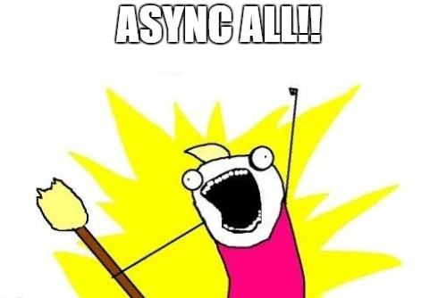

# Async All 
**by [SchwabenCode.com](http://www.schwabencode.com) - Benjamin Abt**

| **VERSIONING** | Build State | NuGet Stable |
|---|---|---|
| master |  |   |
| develop |  |  |

 |  | 

## Website
Checkout the official Page [http://schwabencode.com/projects/AsyncAll](http://schwabencode.com/projects/AsyncAll)

**With AsyncAll you can perform asynchronous operations even the function is synchronous - fully combinable with Tasks and .NET 4.5 async/await-pattern.**

## Give Thanks

If you like the library and saved you time, then maybe respect this with a small donation to the [animal shelter of Stuttgart](http://www.tierheim-stuttgart.de/).

If you want to thank me personally, take a look at [my personal Amazon wishlist](http://www.amazon.de/gp/registry/wishlist/H6KLKT7UMI7Z/).

It would be also very nice when you just write me, if you like this implementation and tell me what you've started!

## License
[MIT License](LICENSE.md)

> Copyright (c) 2015 Benjamin Abt / SCHWABENCODE
> 
> Permission is hereby granted, free of charge, to any person obtaining a copy of this software and associated documentation files (the "Software"), to deal in the Software without restriction, including without limitation the rights to use, copy, modify, merge, publish, distribute, sublicense, and/or sell copies of the Software, and to permit persons to whom the Software is furnished to do so, subject to the following conditions:
> 
> The above copyright notice and this permission notice shall be included in all copies or substantial portions of the Software.
> 
> THE SOFTWARE IS PROVIDED "AS IS", WITHOUT WARRANTY OF ANY KIND, EXPRESS OR IMPLIED, INCLUDING BUT NOT LIMITED TO THE WARRANTIES OF MERCHANTABILITY, FITNESS FOR A PARTICULAR PURPOSE AND NONINFRINGEMENT. IN NO EVENT SHALL THE AUTHORS OR COPYRIGHT HOLDERS BE LIABLE FOR ANY CLAIM, DAMAGES OR OTHER LIABILITY, WHETHER IN AN ACTION OF CONTRACT, TORT OR OTHERWISE, ARISING FROM, OUT OF OR IN CONNECTION WITH THE SOFTWARE OR THE USE OR OTHER DEALINGS IN THE SOFTWARE.

## NuGet
```
Install-Package AsyncAll
```
or visit [AsyncAll on NuGet](https://www.nuget.org/packages/AsyncAll/)

## Branches
- [master](https://github.com/SchwabenCode/AsyncAll/tree/master): stable
- [develop](https://github.com/SchwabenCode/AsyncAll/tree/develop): used during development

## Remarks
This library was created on the basis of my own needs. I am not responsible for integration issues, errors or any damage.
For bugs and features please fork to your own branch, fix it and create a pull request or use the [issue tab](https://github.com/SchwabenCode/AsyncAll/issues).
